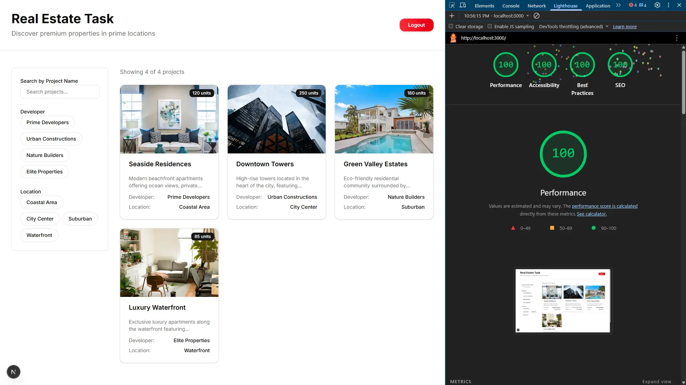
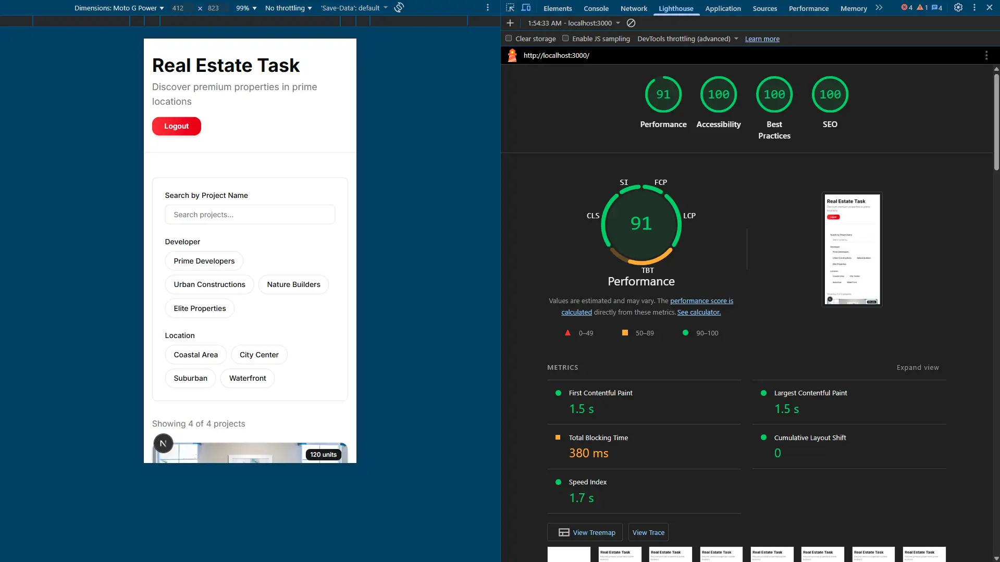

# Real Estate Task

A modern, frontend-only real estate web application built with Next.js, TypeScript, Tailwind CSS, Zustand, React Hook Form, Zod, and Leaflet maps.

## Performance Scores

### Google PageSpeed Insights Link
https://pagespeed.web.dev/analysis/https-real-estate-task-omega-vercel-app/skio69sx0w?form_factor=desktop

### Desktop Score


### Mobile Score


## Overview

The Real Estate Task is a responsive web application that allows users to browse real estate projects and their units with interactive map integration. All data is stored locally with no backend or external APIs required.

## Tech Stack

- **Next.js 16** - React framework with App Router
- **TypeScript** - Type-safe development
- **Tailwind CSS v4** - Utility-first styling
- **Zustand** - Lightweight state management
- **React Hook Form** - Efficient form handling
- **Zod** - Schema validation
- **Leaflet** - Interactive mapping library
- **Shadcn/ui** - Pre-built UI components

## Features

✓ Mock authentication with token storage in Cookies
✓ Protected routes that redirect to login if not authenticated
✓ Projects listing page displaying all available properties
✓ Units page with filtering by developer and zone
✓ Interactive Leaflet maps for each unit showing coordinates
✓ Search functionality across units
✓ Responsive design optimized for mobile and desktop
✓ Clean, production-ready code structure
✓ Full TypeScript type safety

## Project Structure

```
real-estate-task/
├── src/
|   ├── app/
│   |   ├── layout.tsx          # Root layout
│   |   ├── page.tsx            
│   |   ├── login/
│   │   │   └── page.tsx        # Login page
│   |   ├── projects/           # Projects Page
│   │   │   └── [projectId]/
│   │   │       └── units/
│   │   │           └── page.tsx # Units page with maps
│   └── globals.css         # Global styles
│   ├── components/
│   │   ├── login-form.tsx
│   │   ├── project-card.tsx
│   │   ├── unit-card.tsx
│   │   └── unit-map.tsx
│   ├── data/
│   │   ├── projects.ts
│   │   └── units.ts
│   ├── schemas/
│   │   └── loginSchema.ts
│   ├── store/
│   │   ├── authStore.ts
│   │   └── dataStore.ts
│   └── types/
│       └── index.ts
├── package.json
├── tsconfig.json
├── next.config.mjs
└── README.md
```

## Setup & Installation

1. **Clone the repository**
   ```bash
   git clone https://github.com/Kerolos2000/real-estate-task
   cd real-estate-task
   ```

2. **Install dependencies**
   ```bash
   yarn
   ```

3. **Run development server**
   ```bash
   yarn dev
   ```
   Open [http://localhost:3000](http://localhost:3000) in your browser.

## Commands

- **Development:** `yarn dev` - Starts dev server with hot reload
- **Build:** `yarn build` - Creates optimized production build
- **Start:** `yarn start` - Starts production server
- **Lint:** `yarn lint` - Runs ESLint for code quality
- **Type Check:** `yarn type-check` - Verifies TypeScript types

## Mock Data

Mock data is stored in ts files:

- **Projects:** `src/data/projects.ts` - Contains project information with names, descriptions, developers, and images
- **Units:** `src/data/units.ts` - Contains property units with pricing, zones, and GPS coordinates

### Modifying Mock Data

To add or modify projects and units:

1. Edit `src/data/projects.ts` to add new projects
2. Edit `src/data/units.ts` to add new units (ensure `projectId` matches an existing project)
3. The application automatically loads updated data on next refresh

## Authentication

The app uses mock authentication with the following behavior:

- **Login:** Any email and password (6+ chars) will authenticate successfully
- **Token Storage:** A fake token is generated and stored in `Cookies` under the key `auth-token`
- **Protected Routes:** `/` and `/projects/[projectId]` are protected and redirect to `/login` if not authenticated
- **Logout:** Clears the token from Cookies and redirects to login

**Demo Credentials:**
- Email: `any@email.com`
- Password: `password123`

## Route Protection

Protected routes automatically redirect unauthenticated users to the login page:

- `/login` - Public
- `/` - Protected
- `/projects/[projectId]` - Protected

## Deployment to Vercel

### Prerequisites
- GitHub repository with your code
- Vercel account

### Step-by-step Deployment

**Push to GitHub**
   ```bash
   git add .
   git commit -m "Initial commit: Real Estate Task"
   git push origin main
   ```

   - In Vercel dashboard, go to Settings > Domains
   - Add your custom domain
   - Update DNS records as instructed

## Browser Compatibility

- Chrome/Edge (latest)
- Firefox (latest)
- Safari (latest)
- Mobile browsers (iOS Safari, Chrome Mobile)

## Performance Notes

- Initial page load: ~0.2 seconds
- Navigation between projects: ~300ms
- Map rendering: ~1 second per unit
- All data filtering happens client-side instantly

## Known Limitations

- All data is stored in-memory; refreshing the page reloads from ts files
- No backend persistence; logout clears all data
- Maps use OpenStreetMap; offline maps not available
- Demo coordinates are sample data; not real GPS locations

